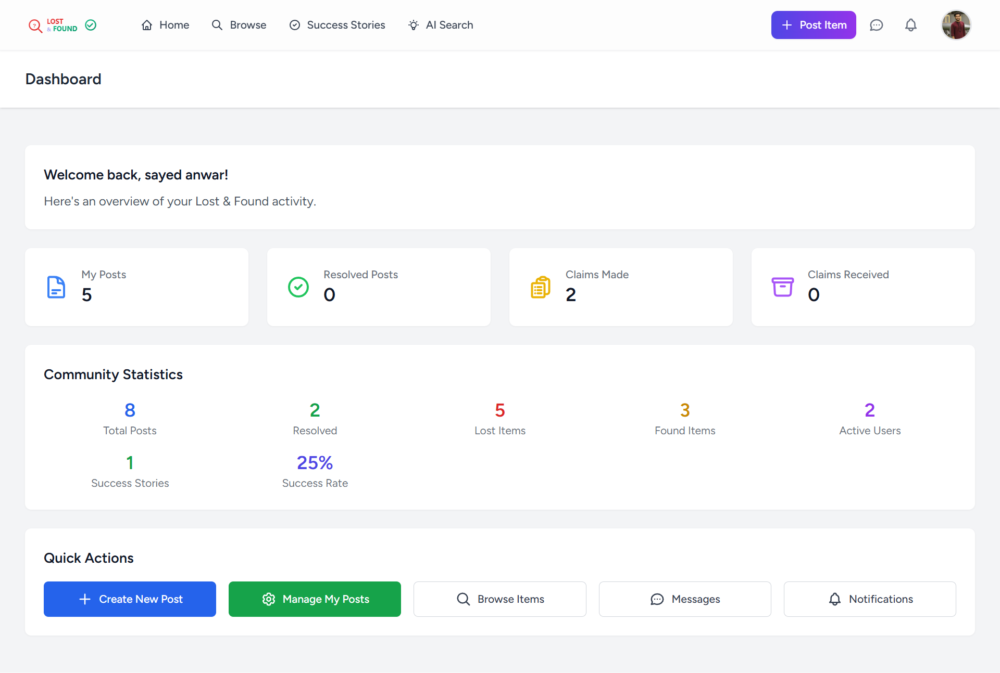
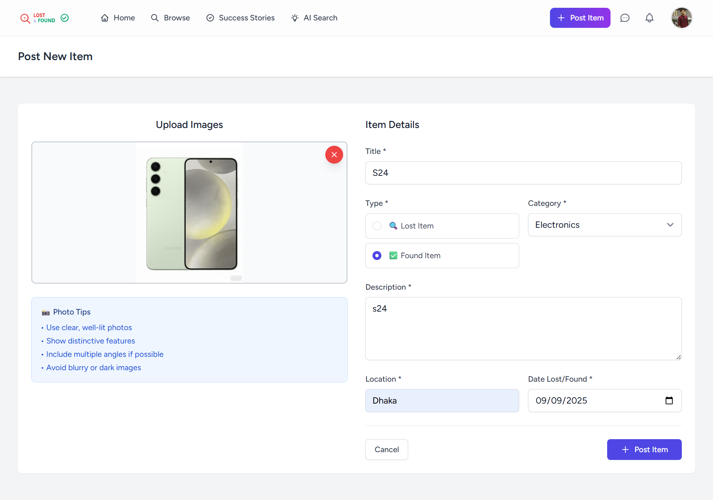
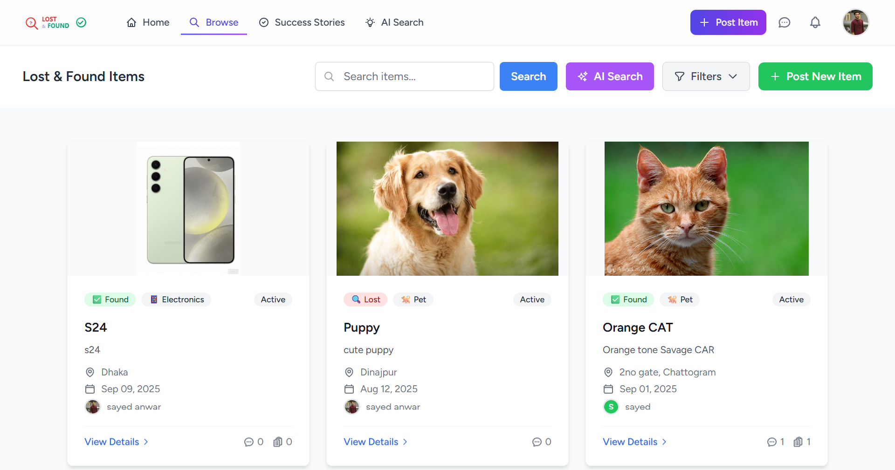
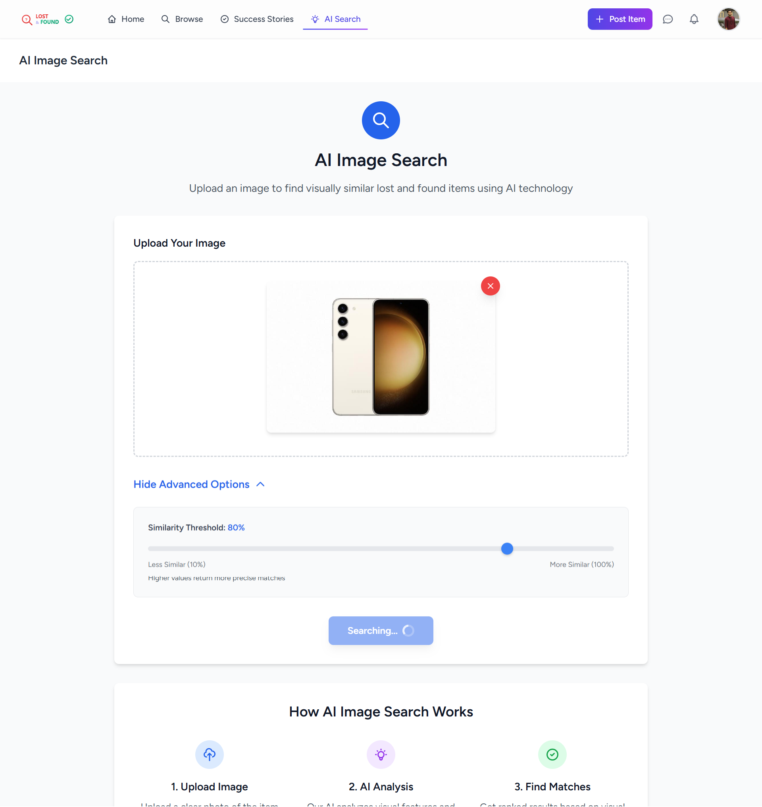
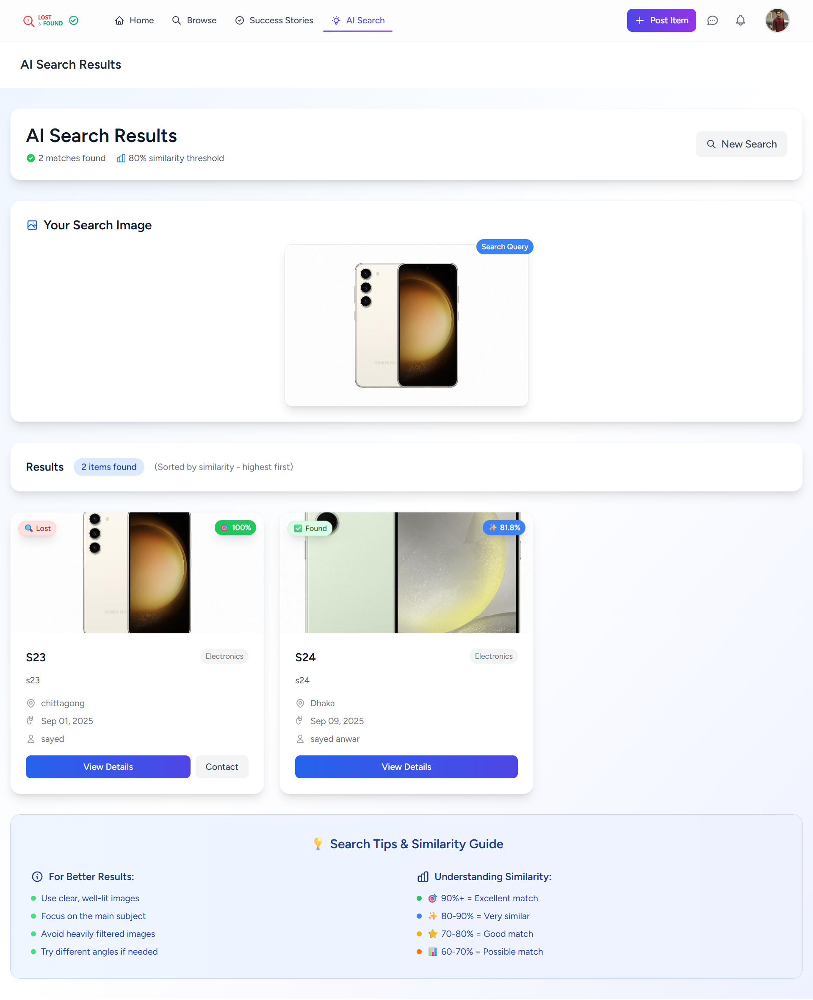
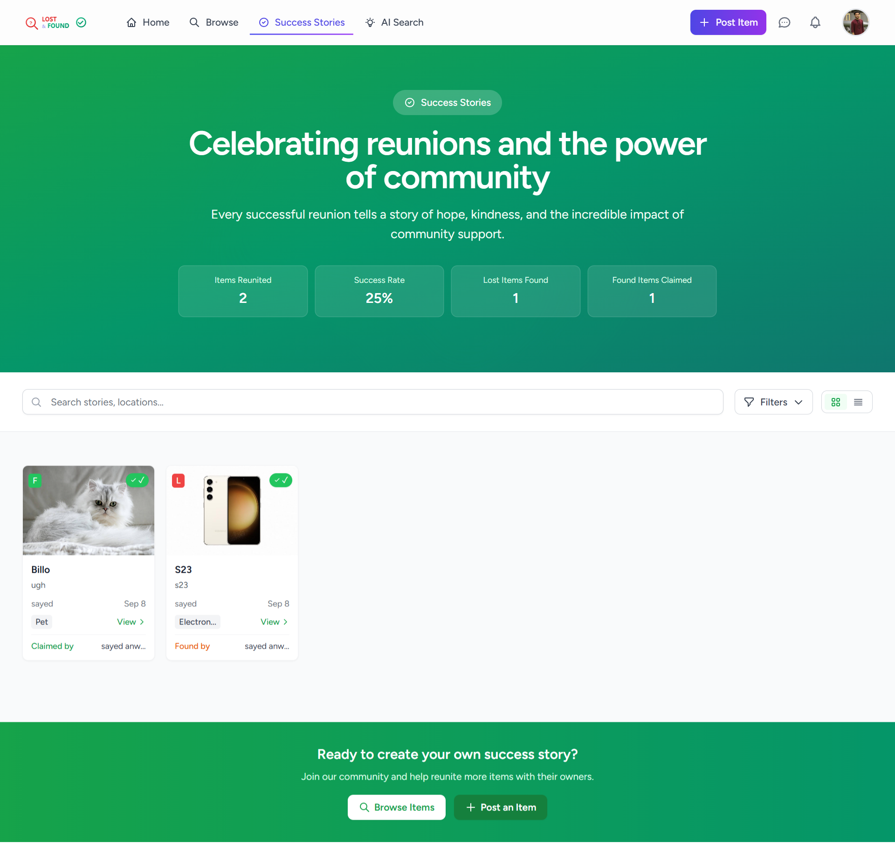

# Lost & Found - AI-Powered Platform

A modern web application built with Laravel that helps people find their lost items and report found belongings. Features AI-powered image search using OpenAI's CLIP model for visual similarity matching.

## Features

### Core Functionality
- **Post Lost/Found Items** - Create detailed posts with images, descriptions, categories, and location data
- **AI-Powered Image Search** - Upload photos to find visually similar items using OpenAI's CLIP model with customizable similarity thresholds
- **Advanced Search & Filtering** - Filter posts by type (lost/found), category, location, date range, and keywords
- **Smart Categorization** - Organize items by categories for better searchability and matching

### Communication & Claims
- **Secure Claim System** - Request to claim items with verification process and status tracking
- **Found Item Notifications** - Notify users when someone reports finding their lost item
- **Direct Messaging** - Private communication between users with conversation management
- **Comment System** - Public comments on posts for additional information and tips

### User Management & Safety
- **User Dashboard** - Comprehensive management of posts, claims, messages, and notifications
- **Post Status Management** - Mark items as active or resolved with bulk operations
- **Notification Center** - Real-time in app notifications for found & claims

### Community Features
- **Success Stories** - Showcase successful item reunions to inspire the community
- **User Feedback System** - Collect and manage user feedback for platform improvement


## Screenshots

### Landing Page

*Modern homepage with hero section and feature highlights*

### User Dashboard

*Personal dashboard for managing posts*

### Post Creation

*Intuitive form for creating lost/found item posts*

### Browse Posts

*Shows all user posts*

### AI Image Search

*AI-powered visual search interface*

### Search Results

*AI search results with similarity scores*

### Success Stories

*Showcase of successful item reunions*

## Technology Stack

- **Backend**: Laravel 12.x, PHP 8.2+
- **Frontend**: Tailwind CSS, Alpine.js, Vite
- **Database**: SQLite (default)
- **AI**: Python 3.8+, OpenAI CLIP, PyTorch

## Requirements

- PHP 8.2+
- Composer
- Node.js 18+
- Python 3.8+
- Git

## Installation

1. **Clone the repository**
   ```bash
   git clone <repository-url>
   cd Final_Project
   ```

2. **Install dependencies**
   ```bash
   composer install
   npm install
   pip install -r requirements_local.txt
   ```

3. **Setup environment**
   ```bash
   cp .env.example .env
   php artisan key:generate
   touch database/database.sqlite
   ```

4. **Setup database**
   ```bash
   php artisan migrate
   php artisan storage:link
   ```

5. **Build assets**
   ```bash
   npm run build
   ```

## Running the Application

**Quick start (recommended):**
```bash
composer run dev
```

This starts the Laravel server, queue worker, and Vite dev server.

**Individual services:**
```bash
# Laravel server
php artisan serve

# Frontend development
npm run dev

# Background jobs
php artisan queue:work
```

Visit `http://localhost:8000` to access the application.

## AI Image Search Setup

1. **Test CLIP integration**
   ```bash
   php local_clip_api.php
   ```

2. **Generate embeddings for existing posts**
   ```bash
   php artisan posts:generate-embeddings
   ```
   
## Configuration

Key settings in `.env`:
```env
APP_NAME="Lost & Found"
APP_URL=http://localhost:8000
DB_CONNECTION=sqlite
QUEUE_CONNECTION=database
```

## Troubleshooting

**Common issues:**

- **Python/AI errors**: Run `python --version` and `pip install -r requirements_local.txt`
- **Permission errors**: `chmod -R 775 storage bootstrap/cache`
- **Database issues**: `php artisan migrate:fresh`
- **Asset errors**: `npm cache clean --force && npm install`

## Team Members

This project was developed by students from the **Department of Computer Science & Engineering, Premier University Chattogram**:

- **Mohammed Sayed Anwar** - ID: 2147
- **Sakib Khan** - ID: 2107  
- **Abdullah Al Miraj** - ID: 2106

## Support

- Check `storage/logs/laravel.log` for errors
- Test AI with `php local_clip_api.php`
- Run `php artisan test` for system checks

---

Built with ❤️ by using Laravel, AI, and modern web technologies.
