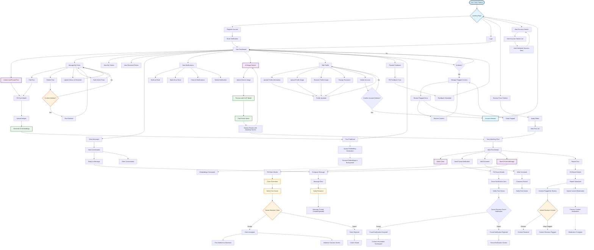

# Lost & Found Platform - Activity Diagram

```mermaid
flowchart TD
    Start([User Visits Platform]) --> Landing{Landing Page}
    
    Landing --> Register[Register Account]
    Landing --> Login[Login]
    Landing --> BrowsePosts[Browse Posts Publicly]
    Landing --> ViewSuccess[View Success Stories]
    
    Register --> EmailVerify[Email Verification]
    EmailVerify --> Dashboard
    Login --> Dashboard[User Dashboard]
    
    Dashboard --> CreatePost[Create Lost/Found Post]
    Dashboard --> MyPosts[Manage My Posts]
    Dashboard --> MyClaims[View My Claims]
    Dashboard --> ReceivedClaims[View Received Claims]
    Dashboard --> Messages[View Messages]
    Dashboard --> Notifications[View Notifications]
    Dashboard --> AISearch[AI Image Search]
    Dashboard --> Profile[Edit Profile]
    
    %% Post Creation Flow
    CreatePost --> PostForm[Fill Post Details]
    PostForm --> UploadImages[Upload Images]
    UploadImages --> GenerateEmbeddings[Generate AI Embeddings]
    GenerateEmbeddings --> PostCreated[Post Published]
    PostCreated --> Dashboard
    
    %% AI Search Flow
    AISearch --> UploadSearchImage[Upload Search Image]
    UploadSearchImage --> ProcessImage[Process with CLIP Model]
    ProcessImage --> FindSimilar[Find Similar Items]
    FindSimilar --> SearchResults[Display Results with Similarity Scores]
    SearchResults --> ViewPost[View Matching Post]
    SearchResults --> AISearch
    
    %% Post Management Flow
    MyPosts --> EditPost[Edit Post]
    MyPosts --> DeletePost[Delete Post]
    MyPosts --> UpdateStatus[Update Status to Resolved]
    MyPosts --> BulkDelete[Bulk Delete Posts]
    
    EditPost --> PostForm
    DeletePost --> ConfirmDelete{Confirm Deletion?}
    ConfirmDelete -->|Yes| PostDeleted[Post Deleted]
    ConfirmDelete -->|No| MyPosts
    PostDeleted --> MyPosts
    UpdateStatus --> MyPosts
    BulkDelete --> MyPosts
    
    %% Public Browsing Flow
    BrowsePosts --> FilterPosts[Apply Filters]
    FilterPosts --> PostList[View Post List]
    PostList --> ViewPost
    
    ViewPost --> PostDetails[View Post Details]
    PostDetails --> MakeClaim[Make Claim]
    PostDetails --> SendFoundNotification[Send Found Notification]
    PostDetails --> AddComment[Add Comment]
    PostDetails --> SendMessage[Send Private Message]
    PostDetails --> ReportPost[Report Post]
    
    %% Claim System Flow
    MakeClaim --> ClaimForm[Fill Claim Details]
    ClaimForm --> ClaimSubmitted[Claim Submitted]
    ClaimSubmitted --> NotifyOwner[Notify Post Owner]
    NotifyOwner --> OwnerReview{Owner Reviews Claim}
    OwnerReview -->|Accept| ClaimAccepted[Claim Accepted]
    OwnerReview -->|Reject| ClaimRejected[Claim Rejected]
    ClaimAccepted --> PostResolved[Post Marked as Resolved]
    ClaimAccepted --> SuccessStory[Added to Success Stories]
    ClaimRejected --> ClaimClosed[Claim Closed]
    
    %% Found Notification Flow
    SendFoundNotification --> FoundForm[Fill Found Details]
    FoundForm --> FoundSubmitted[Found Notification Sent]
    FoundSubmitted --> NotifyOwner2[Notify Post Owner]
    NotifyOwner2 --> OwnerReview2{Owner Reviews Found Notification}
    OwnerReview2 -->|Accept| FoundAccepted[Found Notification Accepted]
    OwnerReview2 -->|Reject| FoundRejected[Found Notification Rejected]
    FoundAccepted --> ContactExchange[Contact Information Exchanged]
    FoundRejected --> FoundClosed[Found Notification Closed]
    
    %% Messaging System Flow
    SendMessage --> MessageForm[Compose Message]
    MessageForm --> MessageSent[Message Sent]
    MessageSent --> NotifyRecipient[Notify Recipient]
    NotifyRecipient --> MessageThread[Message Thread Created/Updated]
    
    Messages --> ViewConversation[View Conversation]
    ViewConversation --> ReplyMessage[Reply to Message]
    ViewConversation --> ClearConversation[Clear Conversation]
    ReplyMessage --> MessageForm
    
    %% Comment System Flow
    AddComment --> CommentForm[Write Comment]
    CommentForm --> CommentPosted[Comment Posted]
    CommentPosted --> NotifyOwner3[Notify Post Owner]
    
    %% Notification System Flow
    Notifications --> MarkAsRead[Mark as Read]
    Notifications --> MarkAllRead[Mark All as Read]
    Notifications --> ClearAll[Clear All Notifications]
    Notifications --> DeleteNotification[Delete Notification]
    
    %% Content Moderation Flow
    ReportPost --> ReportForm[Fill Report Details]
    ReportForm --> ReportSubmitted[Report Submitted]
    ReportSubmitted --> ContentFlagged[Content Flagged for Review]
    ContentFlagged --> AdminReview{Admin Reviews Content}
    AdminReview -->|Restore| ContentRestored[Content Restored]
    AdminReview -->|Keep Flagged| ContentRemains[Content Remains Flagged]
    
    %% Feedback System Flow
    Dashboard --> Feedback[Provide Feedback]
    Feedback --> FeedbackForm[Fill Feedback Form]
    FeedbackForm --> FeedbackSubmitted[Feedback Submitted]
    FeedbackSubmitted --> Dashboard
    
    %% Profile Management Flow
    Profile --> UpdateProfile[Update Profile Information]
    Profile --> UploadAvatar[Upload Profile Image]
    Profile --> RemoveAvatar[Remove Profile Image]
    Profile --> ChangePassword[Change Password]
    Profile --> DeleteAccount[Delete Account]
    
    UpdateProfile --> ProfileUpdated[Profile Updated]
    UploadAvatar --> ProfileUpdated
    RemoveAvatar --> ProfileUpdated
    ChangePassword --> ProfileUpdated
    DeleteAccount --> ConfirmAccountDelete{Confirm Account Deletion?}
    ConfirmAccountDelete -->|Yes| AccountDeleted[Account Deleted]
    ConfirmAccountDelete -->|No| Profile
    
    ProfileUpdated --> Profile
    AccountDeleted --> Landing
    
    %% Background Processes
    PostCreated -.-> QueueEmbedding[Queue Embedding Generation]
    QueueEmbedding -.-> ProcessEmbedding[Process Embeddings in Background]
    ProcessEmbedding -.-> EmbeddingComplete[Embeddings Generated]
    
    ReportSubmitted -.-> QueueModeration[Queue Content Moderation]
    QueueModeration -.-> ProcessModeration[Process Content Moderation]
    ProcessModeration -.-> ModerationComplete[Moderation Complete]
    
    %% Admin Functions
    Dashboard --> AdminPanel{Is Admin?}
    AdminPanel -->|Yes| FlaggedContent[Manage Flagged Content]
    AdminPanel -->|No| Dashboard
    
    FlaggedContent --> ReviewFlagged[Review Flagged Items]
    ReviewFlagged --> RestoreContent[Restore Content]
    ReviewFlagged --> KeepFlagged[Keep Flagged]
    RestoreContent --> FlaggedContent
    KeepFlagged --> FlaggedContent
    
    %% Success Stories Flow
    ViewSuccess --> SuccessList[View Success Stories List]
    SuccessList --> ViewSuccessStory[View Individual Success Story]
    ViewSuccessStory --> ViewSuccess
    
    %% Styling
    classDef startEnd fill:#e1f5fe,stroke:#01579b,stroke-width:2px
    classDef process fill:#f3e5f5,stroke:#4a148c,stroke-width:2px
    classDef decision fill:#fff3e0,stroke:#e65100,stroke-width:2px
    classDef aiProcess fill:#e8f5e8,stroke:#2e7d32,stroke-width:2px
    classDef notification fill:#fff8e1,stroke:#f57f17,stroke-width:2px
    
    class Start,Landing,AccountDeleted startEnd
    class CreatePost,AISearch,MakeClaim,SendMessage process
    class ConfirmDelete,OwnerReview,AdminReview decision
    class ProcessImage,GenerateEmbeddings,FindSimilar aiProcess
    class NotifyOwner,NotifyRecipient,ClaimSubmitted notification
```