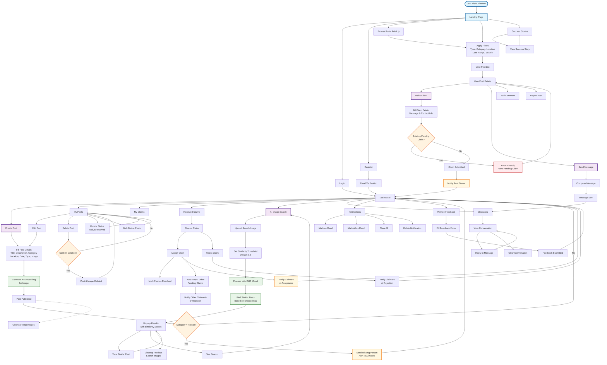

# Lost & Found Platform - Simplified Activity Diagram

```mermaid
flowchart TD
    Start([User Visits Platform]) --> Landing[Landing Page]
    
    %% Authentication Flow
    Landing --> Login[Login]
    Landing --> Register[Register]
    Landing --> BrowsePublic[Browse Posts Publicly]
    
    Register --> EmailVerify[Email Verification]
    EmailVerify --> Dashboard[Dashboard]
    Login --> Dashboard
    
    %% Main Dashboard Actions
    Dashboard --> CreatePost[Create Post]
    Dashboard --> MyPosts[My Posts]
    Dashboard --> MyClaims[My Claims]
    Dashboard --> ReceivedClaims[Received Claims]
    Dashboard --> AISearch[AI Image Search]
    Dashboard --> Messages[Messages]
    Dashboard --> Notifications[Notifications]
    
    %% Post Creation Flow
    CreatePost --> PostForm[Fill Post Details<br/>Title, Description, Category<br/>Location, Date, Type, Image]
    PostForm --> GenerateEmbedding[Generate AI Embedding<br/>for Image]
    GenerateEmbedding --> PostPublished[Post Published]
    PostPublished --> NotifyUsers{Category = Person?}
    NotifyUsers -->|Yes| SendMissingPersonAlert[Send Missing Person<br/>Alert to All Users]
    NotifyUsers -->|No| Dashboard
    SendMissingPersonAlert --> Dashboard
    
    %% Browse Posts Flow
    BrowsePublic --> FilterPosts[Apply Filters<br/>Type, Category, Location<br/>Date Range, Search]
    Landing --> FilterPosts
    FilterPosts --> PostList[View Post List]
    PostList --> ViewPost[View Post Details]
    
    %% Post Interaction Flow
    ViewPost --> MakeClaim[Make Claim]
    ViewPost --> SendMessage[Send Message]
    ViewPost --> AddComment[Add Comment]
    ViewPost --> ReportPost[Report Post]
    
    %% Claim System Flow
    MakeClaim --> ClaimForm[Fill Claim Details<br/>Message & Contact Info]
    ClaimForm --> CheckExisting{Existing Pending<br/>Claim?}
    CheckExisting -->|Yes| ClaimError[Error: Already<br/>Have Pending Claim]
    CheckExisting -->|No| ClaimSubmitted[Claim Submitted]
    ClaimSubmitted --> NotifyOwner[Notify Post Owner]
    
    %% Claim Management
    ReceivedClaims --> ReviewClaim[Review Claim]
    ReviewClaim --> AcceptClaim[Accept Claim]
    ReviewClaim --> RejectClaim[Reject Claim]
    
    AcceptClaim --> MarkResolved[Mark Post as Resolved]
    AcceptClaim --> RejectOtherClaims[Auto-Reject Other<br/>Pending Claims]
    AcceptClaim --> NotifyClaimant[Notify Claimant<br/>of Acceptance]
    RejectOtherClaims --> NotifyOtherClaimants[Notify Other Claimants<br/>of Rejection]
    
    RejectClaim --> NotifyRejection[Notify Claimant<br/>of Rejection]
    
    %% AI Image Search Flow
    AISearch --> UploadImage[Upload Search Image]
    UploadImage --> SetThreshold[Set Similarity Threshold<br/>Default: 0.8]
    SetThreshold --> ProcessCLIP[Process with CLIP Model]
    ProcessCLIP --> FindSimilar[Find Similar Posts<br/>Based on Embeddings]
    FindSimilar --> SearchResults[Display Results<br/>with Similarity Scores]
    SearchResults --> ViewSimilarPost[View Similar Post]
    SearchResults --> NewSearch[New Search]
    NewSearch --> AISearch
    
    %% Post Management Flow
    MyPosts --> EditPost[Edit Post]
    MyPosts --> DeletePost[Delete Post]
    MyPosts --> UpdateStatus[Update Status<br/>Active/Resolved]
    MyPosts --> BulkDelete[Bulk Delete Posts]
    
    EditPost --> PostForm
    DeletePost --> ConfirmDelete{Confirm Deletion?}
    ConfirmDelete -->|Yes| PostDeleted[Post & Image Deleted]
    ConfirmDelete -->|No| MyPosts
    
    %% Message System Flow
    SendMessage --> MessageForm[Compose Message]
    MessageForm --> MessageSent[Message Sent]
    Messages --> ViewConversation[View Conversation]
    ViewConversation --> ReplyMessage[Reply to Message]
    ViewConversation --> ClearConversation[Clear Conversation]
    
    %% Notification System Flow
    Notifications --> MarkAsRead[Mark as Read]
    Notifications --> MarkAllRead[Mark All as Read]
    Notifications --> ClearAll[Clear All]
    Notifications --> DeleteNotification[Delete Notification]
    
    %% Success Stories (Public)
    Landing --> SuccessStories[Success Stories]
    SuccessStories --> ViewSuccess[View Success Story]
    
    %% Feedback System
    Dashboard --> Feedback[Provide Feedback]
    Feedback --> FeedbackForm[Fill Feedback Form]
    FeedbackForm --> FeedbackSubmitted[Feedback Submitted]
    
    %% Background Processes (Dotted Lines)
    PostPublished -.-> CleanupImages[Cleanup Temp Images]
    SearchResults -.-> CleanupSearchImages[Cleanup Previous<br/>Search Images]
    
    %% Return Flows
    PostDeleted --> MyPosts
    UpdateStatus --> MyPosts
    BulkDelete --> MyPosts
    ClaimError --> ViewPost
    NotifyOwner --> Dashboard
    NotifyClaimant --> Dashboard
    NotifyRejection --> Dashboard
    MessageSent --> Messages
    ReplyMessage --> ViewConversation
    FeedbackSubmitted --> Dashboard
    ViewSimilarPost --> SearchResults
    ViewSuccess --> SuccessStories
    
    %% Styling
    classDef startEnd fill:#e1f5fe,stroke:#01579b,stroke-width:2px
    classDef process fill:#f3e5f5,stroke:#4a148c,stroke-width:2px
    classDef decision fill:#fff3e0,stroke:#e65100,stroke-width:2px
    classDef aiProcess fill:#e8f5e8,stroke:#2e7d32,stroke-width:2px
    classDef notification fill:#fff8e1,stroke:#f57f17,stroke-width:2px
    classDef error fill:#ffebee,stroke:#c62828,stroke-width:2px
    
    class Start,Landing startEnd
    class CreatePost,AISearch,MakeClaim,SendMessage process
    class CheckExisting,ConfirmDelete,NotifyUsers decision
    class ProcessCLIP,GenerateEmbedding,FindSimilar aiProcess
    class NotifyOwner,NotifyClaimant,SendMissingPersonAlert notification
    class ClaimError error
```